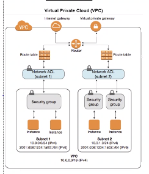

# VPC
## VPC is its own tab (like EC2)
- VPC CIDR block 10.106.0.0/16
- create internet gateway
  - attach internet gateway to VPC
- Route Table (RT)
  - allow CIDR block IP (above)
  - allow all, 0.0.0.0/16
- Public subnet 10.106.1.0/24 - for node-app 3000
  - Connect to VPC 
  - Private subnet 10.106.2.0/24 - used for mongodb 27017
-  associate public subnets to RT
-  Security groups public and private with required rules for public subnets

testing the VPC config for pub subnet and SG for our app

NACL
## Steps
- VPC tab in AWS
- create VPC
  - name (course_name_vpc)
  - CIDR block (assigned in class(above))
  - Create VPC
- Internet gateway in left hand tab (delete on friday)
  - name (course_name_vpc)
- attach to VPC at the top/actions then attach VPC
  - select VPC from dropdown box
  - attach, then check status on previous screen
- create route table (RT) on the left tab, above internet gateway
  - name (course_name_vpc)
  - attach VPC
- allow the traffic
-   - edit routes
    - add route
      - 0.0.0.0/0
      - target = internet gateway
- create subnet left
  - create subnet top right
  - select VPC
  - name (course_name_vpc)
  - availability zone ireland
  - add public ip
  - click on subnet, select route tables in lower row
  - add RT as default one

## VPC EC2
- t2.micro
- config
  - network = course_name_vpc (devops_james_vpc)
  - subnet = only one available
  - auto-assign Public IP = enable

### nat instance for the db

**no global access for db**

- create ami, serach nat, linux type
- set network to be vpc
- choose the one with internet
- security group needs http https, pop3, smtps
- pair key

- in instances, stop source/destination checks
  - right click instance, networking, change resource destination
- go to vpc to connect to route table
- add route, target = nat instance
  - allow internet

- subnet association
  - only db
